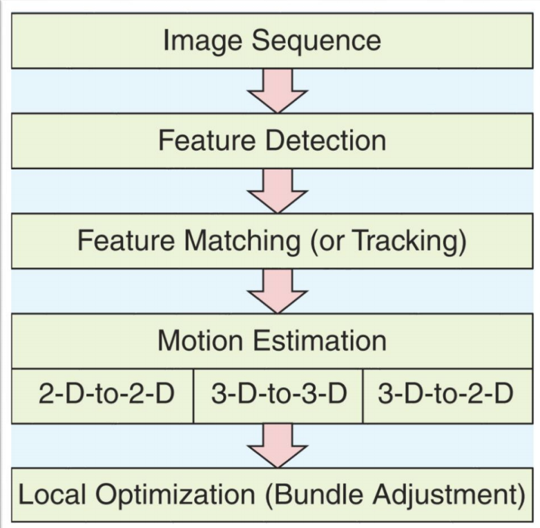
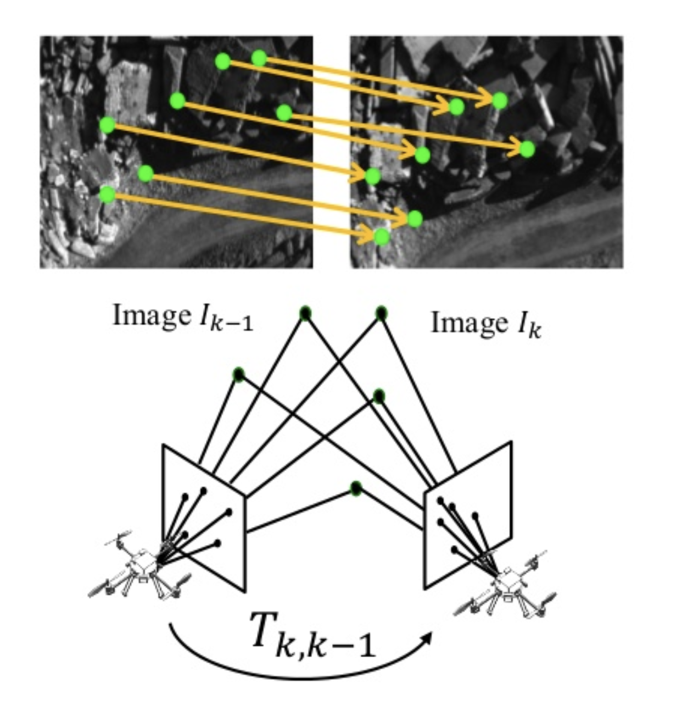

# Geometric feature-based VO Pipeline {#vo-feature-based-pipeline status=beta}

The indirect and sparse method of feature-based visual odometry is the most commonly employed technique for the VO problem. This is the approach used in most state-of-the-art VO systems as VO is an inherently geometric problem and the algorithms have straightforward computations.

<figure>
    
    <figcaption>Feature-based VO Pipeline</figcaption>
</figure>

### **Feature Detection** :

This step involves searching the image for salient keypoints that are likely to match well in other images.

A local feature is an image pattern that differs from its immediate neighborhood in terms of intensity, color, and texture.

 

The most commonly used type of features detectors used for VO are :

* **Corner** :
      - A point at the intersection of two or more edges.
      - *Examples :* Harris, Shi Tomasi, FAST, Difference of Gaussians, etc.

 

* **Blob** :
      - An image pattern that differs from its immediate neighborhood  in its intensity, color, and texture.
      - It is neither an edge nor a corner.
      - *Example :* SIFT, SURF, CENSURE, etc.

 

Properties of a good feature detector :
 

  * localization accuracy (both in position and scale)
  * repeatability (redection of features in the other images)
  * computational efficiency
  * robustness (to noise, compression artifacts, blur)
  * distinctiveness ( better feature match across images)
  * invariance (to both photometric and geometric changes)

 

*Remark :*

  - Corner detectors are fast to compute but are less distinctive
  - Blob detectors are more distinctive but slower to detect.
  - Feature detectors could be point-feature detectors
  - Each detector has its own pros and cons. It must be chosen based on the application scenario.

 

### **Feature Matching / Tracking** :

The goal of this step is to find feature points and their respective correspondences. This is can be achieved using two distinct approaches of matching and tracking.

   

  * **Feature Tracking** :

       

      This approach uses the detected features in one image and tracks the same features in the next image by using local search techniques such as correlation.

      It is ideal when the images are taken from viewpoints that are closer to each other. However if this condition is not met, an affine-distortion model like the Kanade-Lucas-Tomasi (KLT) tracker can be applied to the features.
       

  * **Feature Matching** :

       

      This approach independently detect features in all the images and match them based on some similarity metric between their descriptors.

      It is preferred in cases of significant viewpoint changes

       

      There are many ways to perform the matching task :

      - Exhaustive matching (matching every feature with every other feature)
      - Constrained matching (matching only in neighborhood)
      - Epipolar matching (based on the epipolar constraint)

         

    **Outlier Detection**

     

    The matched points are usually contaminated by outliers arising from wrong data associations due to image noise, occlusions, blur, and changes in viewpoint and illumination not considered by the feature detector.

     

    This is an essential step after feature matching to ensures that the camera motion is estimated accurately.
     

      - Random sample consensus (RANSAC) is the standard method for model estimation in the presence of outliers.
       

      - RANSAC is applied by computing model hypotheses from randomly sampled sets of data points and then verifying these hypotheses on the other data points. The hypothesis that shows the highest consensus with the other data is selected as a solution.

 

### **Motion Estimation** :

   

  Motion estimation is the most crucial step performed for each image in VO computation. The goal is to estimate the motion from the pair of consecutive images.

  

  <figure>
      
      <figcaption>Feature-based VO Pipeline</figcaption>
  </figure>
  

   

  For each consecutive pair ofimages $I_{k-1}$ and $I_k$, this step estimates the parameters of the transformation $ T_k $ from the pair  of corresponding features $f_{k-1}$ and $f_k$ respectively as denoted by Figure 2.

     

  Three different methods arise depending on the dimensions in which the feature  correspondences are specified :  

  | Motion Estimation Method| $f_{k-1}$ | $f_{k}$ |                                                                                      Description                                                                                     |   
  |:-----------------:|:---------:|:-------:|:--------------------------------------------------------------------------------------------------------------------------------------------------------------------------------:|---|
  |     2-D-to-2-D    |     2D    |    2D   | 2-D image features used directly |   
  |     3-D-to-3-D    |     3D    |    3D   | Possible only for stereo VO   3-D points at each time instant triangulated  |   
  |     3-D-to-2-D    |     3D    |    2D   | For monocular VO,  two consecutive images   ($I_{k-2}$  and $I_{k-1}$)  triangulated to get 3-D features  and matched with  2-D image features of the   next image ($ I_k $ ) |   

 Table : Summary of motion-estimation methods 

 

More details about these motion estimation methods can be found in the [next section](#vo-motion-estimation).

 

  **Scale Estimation :**

* Computing the absolute scale of translation from two consecutive images is not possible, so relative scales need to be computed from them.
* This relative scale is expressed as a distance ratio.
* The estimated translation vector is then scaled with this distance ratio.
* It is worth noting that the relative-scale computation requires features to be matched (or tracked) over multiple frames (at least
three) for the monocular case.

### **Local Optimization** :

   

  The computation of the camera path incrementally as consecutive transformations is bound to introduce errors that can accumulate over time resulting in a drift of the estimated trajectory from the actual one.

   

  The local optimization step optimizes over the last m camera poses to keep drift as small as possible.

   

  * __Pose-Graph Optimization__ :
         
        Cameras poses improved by computing transformations between non-adjacent frames used as additional constraints.
         
  * __(Sliding window) Bundle Adjustment__ :
         
        Similar to pose-graph optimization with an additional optimization of the 3-D landmark parameters.
         

  * __Using information from other sensors__ (IMU, GPS, etc.)
