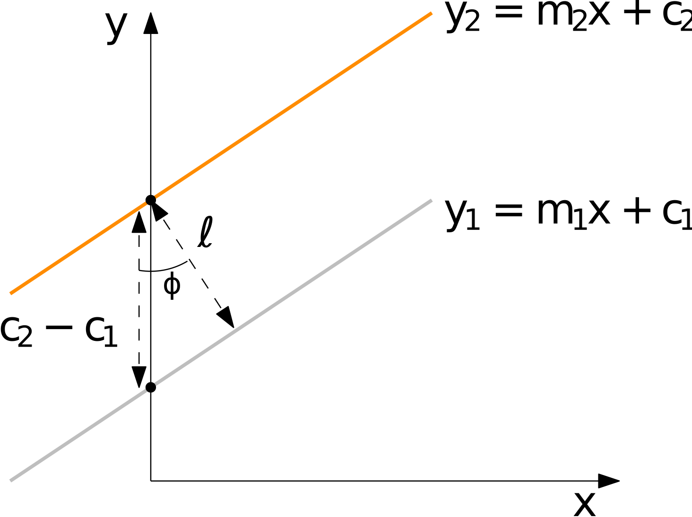

# Fitting Two Parallel Lines to Line Segments {#two_lane_fitting status=beta}
In this section, two straight lines are simultaneously fit to yellow and white line segments while enforcing the two lines to be parallel and to maintain a pre-specified separation distance $\ell$. Doing this takes advantage of the fact that we have a good model for the lanes: we know that they are parallel, and we know the separation distance pretty well. We will use a least squares approach, much like linear regression, but with two lines at once. With each segment, we can extract points that have $(x,y)$ coordinates in the duckiebot frame.

<figure>
    <figcaption>Notation used for fitting two lines at once.</figcaption>
    
</figure>

Using the notation from the above figure, enforcing the lines be parallel requires that they have the same slope

$$m_1 = m_2 = m.$$

Enforcing the lines to have a separation distance $\ell$ leads to

$$c_2 - c_1 = \cos(\varphi) \ell.$$

It can be shown that $\cos(\varphi) = 1/\sqrt{1 + m^2}$, thus leading to

$$c_2 = \ell \sqrt{1 + m^2} + c_1.$$ 

Hence, the yellow line can be parameterized in terms of the coefficients of the white line, that being $m$ and $c_1 = c$,

$$y_2 = mx + c + \ell \sqrt{1 + m^2}.$$

Since the constraints have been incorporated, the two parameters $m$ and $c$ now define both lines. To fit the lines using a least squares approach, minimize the cost function $J(\boldsymbol{\theta}) = 1/2 \mathbf{e}^T\mathbf{e}$ by varying $\boldsymbol{\theta}$ where $\boldsymbol{\theta} = [m \, c]^T$ are the parameters and

$$\mathbf{e}(\boldsymbol{\theta})  = \left[\begin{array}{c} y_{w1} - (m x_{W1} + c) \\ \vdots \\ y_{W1} - (m x_{WN} + c) \\ \hline y_{Y1} - (m x_{Y1} + c + \ell \sqrt{1 + m^2}) \\ \vdots \\  y_{YM} - (m x_{YM} + c + \ell \sqrt{1 + m^2}) \end{array} \right],$$

and $(x_{W1},y_{W1}), \ldots, (x_{WN},y_{WN})$ and $(x_{Y1},y_{Y1}), \ldots, (x_{YN},y_{YN})$ are ground plane coordinates of white and yellow points, respectively. The first "chunk" of $\mathbf{e}(\boldsymbol{\theta})$ (i.e. above the horizontal line) corresponds to errors associated with the white line and the white points. The second "chunk" corresponds to errors associated with the yellow line and yellow points. Because we have substituted in the constraints, $\mathbf{e}(\boldsymbol{\theta})$ is now a nonlinear function of $m,c$. Therefore, we must use nonlinear least squares to iteratively solve this problem online. Fortunately, this only requires 1 or 2 iterations, and is very fast to compute. The nonlinear least squares algorithm (also known as the Gauss-Newton algorithm) iterates the following until convergence,

$$ \boldsymbol{\theta}_{k+1} = \boldsymbol{\theta}_k - (\mathbf{H}^T \mathbf{H})^{-1}\mathbf{H}^T \mathbf{e}$$,

where

$$\mathbf{H} = \frac{\textrm{d}\mathbf{e}(\boldsymbol{\theta})  }{\textrm{d}\boldsymbol{\theta}} = \left[\begin{array}{cc} -x_{W1} & -1 \\ \vdots & \vdots \\ -x_{WN} & -1 \\ -x_{Y1} + \ell m/ \sqrt{m^2 + 1} & -1 \\ \vdots & \vdots \\ -x_{YN} + \ell m/ \sqrt{m^2 + 1} & -1 \end{array} \right]$$

is the Jacobian of $\mathbf{e}$ with respect to $\boldsymbol{\theta}$.

## Issues and Possible Improvements
This works relatively well, and is definitely much more robust than individually fitting white and yellow lanes. Some issues include:

1. If the duckiebot is at $90^\circ$ to the lane, this results in $m = \infty$, which breaks the algorithm.
2. Outlying white and yellow segments can still influence the estimate.
3. Not very appropriate for corners/curved roads.

Point 1 can be addressed by parameterizing the lines a different way, but this might result in a constrained least squares problem. Point 2 can be addressed by somehow combining this method with  RANSAC procedure, and point 3 can be addressed by using a more sophisticated model than a straight line, such as a polynomial or a Bezier curve. If doing so, a method of enforcing the parallel and separation distance constraints is needed.
