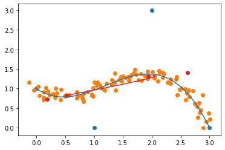
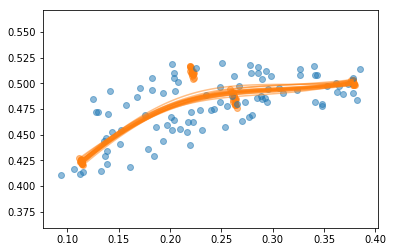

# Bézier curves for richer state estimation{#bezier status=ready}

We would like to improve the performance of the state estimation system by using the full lines rather than just trying to fit a straight lane on a curved path.

We do that by fitting a Bézier curve on the different parts of the image to produce a representation of the environment that is both lightweight and rich.

We also propose a Kalman filter formulation of the problem, enabling a faster estimation at each time step (although a proper fit is still needed from time to time).

A full derivation of the different blocks can be found [here](https://github.com/bdura/merganser).

## Inputs

This node uses a preprocessed view of the video feed, wherein the pixels have been clustered into the different lines (with the color known) and projected into the robot frame. In the [proposed implementation](https://github.com/bdura/merganser), we use a skeletonisation of the patches to reduce the computational load.

In the case of the Kalman filter formulation, we also need to subscribe to the commands of the robot (for the process model).

## Bézier curves

### Definitions

Recall the recursive definition of a Bézier curve. Let $\mathrm{Bezier}_{\mathbf{p}_0,\mathbf{p}_1,\dots, \mathbf{p}_n} : [0,1] \to \R^2$ be the Bézier curve defined by the control points $\mathbf{p}_0,\mathbf{p}_1,\dots, \mathbf{p}_n$. Then:

\begin{align*}
    \mathrm{Bezier}_\mathbf{p}(\alpha) &= \mathbf{p} \\
    \text{and} \qquad \mathrm{Bezier}_{\mathbf{p}_0:\mathbf{p}_n}(\alpha) &= (1-\alpha) \cdot \mathrm{Bezier}_{\mathbf{p}_0:\mathbf{p}_{n-1}}(\alpha) + \alpha \cdot \mathrm{Bezier}_{\mathbf{p}_1:\mathbf{p}_n}(\alpha)
\end{align*}

Which decomposes into the following explicit definition:

\begin{equation}
    \mathrm{Bezier}_{\mathbf{p}_0:\mathbf{p}_n}(\alpha) = \sum_{i=0}^n {n \choose i} \alpha^i (1-\alpha)^{n-i} \mathbf{p}_i
\end{equation}

$\displaystyle b_i^n(\alpha) = {n \choose i} \alpha^i (1-\alpha)^{n-i}$ forms the \textit{Bernstein polynomial basis}.

### Fitting the lines

Our goal is to obtain a light-weight yet meaningful representation of the lines seen by the duckie. To that end, we need to be able to find a Bézier curve that best fits the detected lines, represented by a point cloud mapped onto the robot frame.

If we could assign a value $t_\mathbf{c}$ to each point $\mathbf{c}$ within the point cloud, then fitting the curve would boil down to a least-square problem with a closed-form solution:

\begin{equation}
    \label{eq:ls}
    \theta^* = \operatorname*{arg\,min}_\theta \sum_{\mathbf{c} \in C} ||\mathbf{c} - \mathrm{Bezier}_\theta(\alpha_\mathbf{c})||^2
\end{equation}

Where $\theta$ is the parametrisation of the Bézier curve, ie a set of four control points.

Moreover, noticing that:

\begin{equation}
    \mathrm{Bezier}_\theta(\alpha) = \sum_{i=0}^n b_i^n(\alpha_\mathbf{c}) \cdot \mathbf{p}_i = \mathbf{b}^n(\alpha)^\top \theta
\end{equation}

Where $\mathbf{b}^n(\alpha)$ is a vector containing all components of the Bernstein polynomial of degree $n$, evaluated in $t$ ; and using a lax notation, $\theta = \begin{bmatrix} \mathbf{p}_0, \mathbf{p}_1, \mathbf{p}_2, \mathbf{p}_3 \end{bmatrix}^\top$.

Using these notations, equation \eqref{eq:ls} can be re-written in matrix form:

\begin{equation}
    \theta^* = \operatorname*{arg\,min}_\theta ||\mathbf{C} - \mathbf{B}(\mathbf{C}) \cdot \mathbf{P}||^2
    \label{eq:ls-matrix}
\end{equation}

Where $\mathbf{C}$ and $\mathbf{B}(\mathbf{C})$ are the matrices obtained by stacking respectively the points within the cloud to fit, and the "Bernstein vectors" $\mathbf{b}^n(t_\mathbf{c})$ for all $\mathbf{c}$ in $C$.

Provided $\mathbf{B}(\mathbf{C})$ be full-rank, equation \eqref{eq:ls-matrix} has the closed-form solution:

\begin{equation}
    \boxed{\theta^* = (\mathbf{B}(\mathbf{C})^\top \mathbf{B}(\mathbf{C})) \mathbf{B}(\mathbf{C})^\top \mathbf{C}}
\end{equation}

However, this solution only exists because we could artificially assign the right $t_\mathbf{c}$ to each point within the Bézier curve. Since we do not have access to that information, we use the following non-convex loss instead:

\begin{equation}
    \boxed{\mathcal{L}(\theta, C) = \sum_{\mathbf{c} \in C} \min_{\alpha \in \{0, \alpha_1, \dots, 1\}} ||\mathbf{c} - \mathbf{b}^n(\alpha)^\top \theta||^2}
    \label{eq:loss}
\end{equation}

And use gradient descent to optimise the parameters of the curve.

The two figures above show the fitting process on a synthetic example.

The figure above presents a fitted image taken from actual data retrieved from the duckie. Note that the points have not been projected into the robot frame, and instead the Bézier curves are fitted in pixel space.

## Kalman Filtering

Performing gradient descent on equation \eqref{eq:loss} is computationally costly. Can we use the dynamics of the robot to alleviate some of that cost ?

In order to make the Bézier curve more lightweight to compute, we can make use of the information we have concerning the evolution of the robot. Hence, we can first re-use the solution from a previous time frame as an initialisation for the next, using the kinetics of the robot to adjust it.

Moreover, we can frame the Bézier curve fitting process as a Kalman filter, in order to limit the frequency of gradient descent steps.

### Problem formulation

\begin{align}
    \bar{\theta}_{t+1} &= \mathbf{R} \theta_\alpha + \mathbf{t} + \varepsilon_p & & \text{the process} \\
    \Big\{ \mathbf{c} &= \mathbf{b}^n(\alpha_\mathbf{c})^\top \cdot \mathbf{P} + \varepsilon_o  \Big\}_{\mathbf{c} \in C_t} & & \text{the observations}
    \label{eq:kalman}
\end{align}

Here $\mathbf{R}$ is the rotation matrix and $\mathbf{t}$ is the translation term coming from the transition model. Both can be easily computed using the commands sent to the duckie.

In this model, we assume that the observation points are generated by a gaussian distribution whose mean is a point on the Bézier curve. Both $\varepsilon_o$ and $\varepsilon_p$ are Gaussian noise with zero mean and spherical covariance.

For the formulation to be tractable, we need to assign an $\alpha_\mathbf{c}$ to each point in the observations. We use the value that gives the closest point on the curve using the _predicted_ Bézier curve. More formally:

\begin{equation}
    \forall \, \mathbf{c}, \qquad
    \alpha_\mathbf{c} = \operatorname*{arg\,min}_\alpha ||\mathbf{c} - \mathbf{b}^n(\alpha)^\top \cdot \bar{\theta}_{t+1}||^2
\end{equation}

### Derivation

Equation \eqref{eq:kalman} give the general equation for the Kalman filtering formulation of the problem. Let us now derive its closed-form solution.

The parameters of the model are $(\mu, \Sigma)$, where $\mu$ is the concatenation of the coordinates for the four control points, and $\Sigma$ is the 8x8 covariance matrix that together with $\mu$ define the Gaussian distribution that is assumed to govern the Bézier curve.

The general process to fit the curve is as follows:

1. We use the process model to predict the new parameters using the ones from the previous time step, ie $\bar\theta_{t+1} =  p(\theta_{t+1} \mid C_{0:t}, \mathbf{u}_{0:t+1})$, where $\mathbf{u}$ is the control signal.

2. Then, we assign an $\alpha$ for each point in the observation, using $\bar\theta$.

3. Using the observation model, we compute the correction to the prediction to get $\theta_{t+1}$.

#### Process model

The process model is easy to derive, using the standard properties of the multivariate Gaussian distribution. Hence:

\begin{align}
    \Aboxed{\bar\mu_{t+1} &= \mathbf{R} \mu_t + \mathbf{t}} & \text{and}& &
    \Aboxed{\bar\Sigma_{t+1} &= \mathbf{R} \Sigma_t \mathbf{R}^\top}
\end{align}

The figure above shows the process model in action. The orange cloud is fitted using gradient descent to get the orange Bézier curve, and the blue cloud is the transformed cloud with some amount of noise.

#### Observation model

As we've established, we use :

\begin{equation}
    \forall \, \mathbf{c}, \qquad
    \alpha_\mathbf{c} = \operatorname*{arg\,min}_\alpha ||\mathbf{c} - \mathbf{b}^n(\alpha)^\top \cdot \bar{\theta}_{t+1}||^2
\end{equation}

as the values for $\alpha$.

With the above assumptions, the we can compute the covariance for the observation noise:

\begin{equation}
    \boxed{\mathrm{Cov} \left[ \varepsilon_o \right] = \frac{1}{|C_t|} \sum_{\mathbf{c} \in C_t} (\mathbf{c} - \mathrm{Bezier}_{\bar\theta_{t+1}}(\alpha_\mathbf{c})}
\end{equation}

Note that this gives us a probabilistic interpretation of the Bézier curve process. In the figure above, we have sampled 20 different sets of control points.
