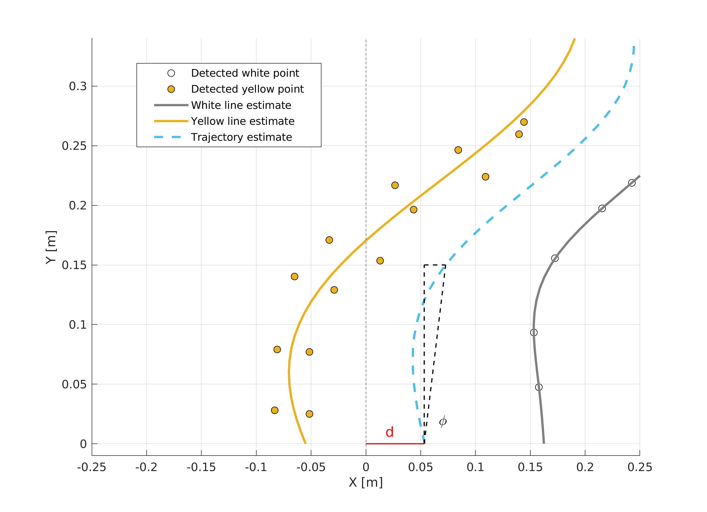
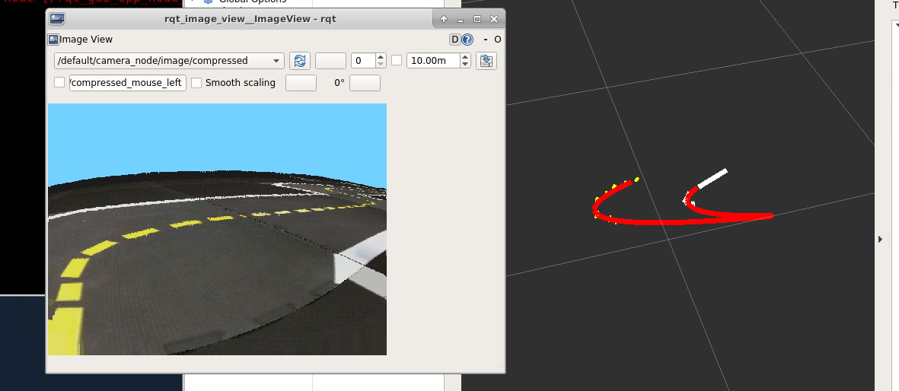

## Gaussian process regression for lane modeling {#gaussian_processes status=beta}

Gaussian process regression models [[1]](#1) are a method for fitting
parameter-free models to data.  Rather than assuming the form of a model and
performing an optimization step to solve for the model parameters (e.g. line
fitting), GPR models generate predictions at test locations using Bayesian
regression.  A new model is therefore generated for each set of training points.
To adapt the model to the expected variance in the data, a training phase is
performed to learn the model *hyperparameters*, which parameterize how the model
changes away from the training points.  This information is encoded into *kernel
functions*, which serve as an analogue for the variance in the Bayesian
regression step. 

Gaussian process regression models can be used to parameterize the lane boundaries
in Duckietown for an improved estimate of the lane pose.  These models proved to
be more adaptive than a linear approximation, but robustness was a problem.
Background on GPR models, as well as details on the implementation, are
discussed below. 

### Gaussian process regression models

A Gaussian process is an infinite collection of random variables, any finite
combination of which are jointly normally distributed [[1]](#1).  Therefore,
the process may be completely parameterized by its mean and covariance, 

$$f (\mathbf{x}) \sim \mathcal{GP} \big( m (\mathbf{x} , k (\mathbf{x},
\mathbf{x}^\prime) \big) \text{.}$$

To represent this underlying process, a GPR model $\mathcal{D}$ may be learned
from a finite number of training observations, $\mathbf{x}_i$, 

$$\mathcal{D} = \big\{ (\mathbf{x}_i,y_i) \ \big| \ i = 1, \ldots, n, \ \mathbf{x}_i \in \mathbb{R}^d, \ y_i \in \mathbb{R} \big\} \text{.} $$

Predictions $f_*$ at test locations $\mathbf{x}_*$ may be obtained from the
model by leveraging the fact that both the training and test observations are
jointly distributed according to the same model,

$$
    p( \, f_* \, | \, \mathbf{y}, \mathbf{X}, \mathbf{x}_*) \sim \mathcal{N}\Bigg( \begin{bmatrix}
        \, \bar{f}_* \\ \bar{\mathbf{y}}
    \end{bmatrix}, \begin{bmatrix}
        k(\mathbf{x}_*, \mathbf{x}_*) & \mathbf{k}(\mathbf{x}_*, \mathbf{X}) \\ \mathbf{k}(\mathbf{X}, \mathbf{x}_*) & \mathbf{K}_y(\mathbf{X}, \mathbf{X})
    \end{bmatrix} \Bigg).
$$

This leads to 

$$
    \bar{f}_* = \text{E}[{f(\mathbf{x}_*)}] = \mathbf{k}(\mathbf{X}, \mathbf{x}_*)^\mathsf{T} \mathbf{K}_y(\mathbf{X}, \mathbf{X})^{-1}\mathbf{y}, 
$$
$$
    \Sigma_* = \text{Cov}[(f_* - \bar{f}_*)(f_* - \bar{f}_*)^\mathsf{T}] = k(\mathbf{x}_*,\mathbf{x}_*) - \mathbf{k}(\mathbf{X}, \mathbf{x}_*)^\mathsf{T} \mathbf{K}_y(\mathbf{X}, \mathbf{X})^{-1} \mathbf{k}(\mathbf{X}, \mathbf{x}_*)\text{.} 
$$

In both of these equations, $k(\mathbf{x}, \mathbf{x}^\prime)$ is called the
*kernel function*, and parameterizes the covariance between the different
training points.  Put another way, the kernel function describes how the model
is expected to change as the test inputs are varied. 

### Training the hyperparameters of the kernel function
Given the smooth spatial variation of the lane boundaries, a squared exponential
function was selected to parameterize the expected spatial variation in the
model.  In its most basic form, this kernel function is

$$
    k_{SE}(\mathbf{x}, \mathbf{x}^\prime) = \exp \bigg( \frac{\| \mathbf{x} -
    \mathbf{x}^\prime \|^2}{\ell^2} \bigg).
$$

This kernel function may also be linearly combined with a constant,
$\sigma_s^2$, to represent nonzero-mean functions.  Here, $\sigma_s^2$ was set
to half the lane width, $\sigma_s^2 = d_{lane} / 2$.

The hyperparameter $\ell$ was learned by optimizing for hyperparameter fit over
multiple observations of ground-projected lane keypoints.  An example output is
shown in the following figure. 

 

### Implementation

A number of implementation details are discussed in this section.  First, on the
image processing side, points in the yellow lane were detected using Shi-Tomasi
keypoint detectors instead of the default probabilistic Hough line detector.
This helped with outlier rejection, as the Duckies in the background were not
picked up by this detector.  To avoid picking up blobs of white pixels in the
yellow lane (due to reflection in the simulator, these could be mistaken for
elements of the white lane), all but the largest component of white pixels was
ignored from lane detection.  

Second, a threshold was constructed on the ground plane around the vehicle to
ensure that the GP estimated in each frame did not include as part of the
training set points that were `too far away' from the vehicle.  In practice,
keypoints further than $r_{thresh} = 0.25 \textrm{m}$ away from the Duckiebot were not
included in the training set.  To help stabilize the lane estimate, a buffer of
keypoints was tracked by the estimator class, and updated with each image using
odometry information (commanded wheel movements).  

Finally, to extract estimates $d$ and $\phi$ from the resulting lane fits, a
small lookahead distance was used (similar to what was done in the pure pursuit
control assignment).  The parameters could then be computed as is shown in the
above figure.

### Results

The resulting lane estimates, along with the white and yellow lane observations,
are shown in the following figure.  The models parameterize the upcoming right
turn reasonably well, however the two models appear to merge together closer to
the Duckiebot.  This is likely an issue with the construction of the buffer,
where observations are cleared after a fixed amount of time regardless of
whether the Duckiebot is stationary.  Since keypoint tracking depended on
integrating odometry information, and since there was an issue in determining
the timestep $\Delta t$ in the simulator, this could have also skewed the
results.  

The Duckiebot drove reasonably well in the simulator using this estimator,
however the lane estimates were very noisy.  Incorporating this estimate into a
filter, where vehicle dynamics could be use to temper the effects of the noisy
measurements, would be useful in improving performance. 

 

## References
<a id="1">[1]</a> Williams CK, Rasmussen CE. Gaussian processes for machine
learning. Cambridge, MA: MIT press; 2006.

